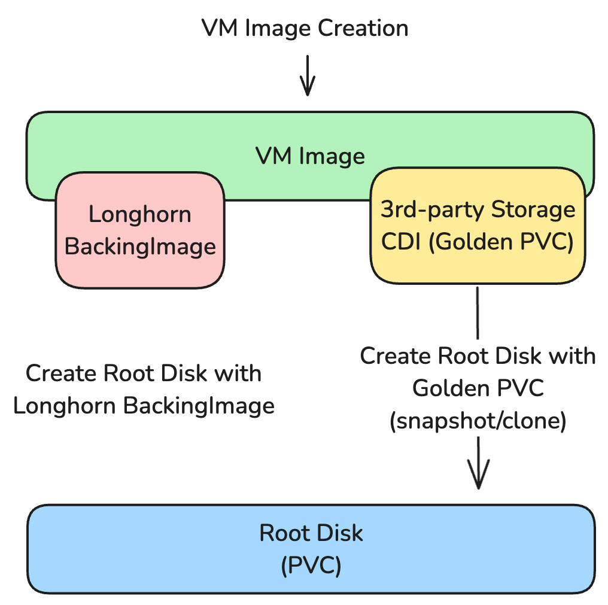

# Third Party Storage Support

Third-party storage support is a feature that allows users to use third-party storage solutions in Harvester for root disks and data disks.

## Summary

This enhancement aims to provide a generic way to leverage third-party storage solutions which already have CSI driver. By introducing Containerized-Data Importer (CDI), Harvester can support third-party storage solutions with the current Virtual Machine Image path for the root and data disks.

### Related Issues

https://github.com/harvester/harvester/issues/1199

## Motivation

### Goals

To provide a generic way to leverage third-party storage solutions with the current Virtual Machine Image path for root and data disks.

### Non-goals [optional]

Virtual Machine Backup and Restore with third-party storage are not in the scope of this enhancement.

## Proposal

We will introduce Containerized-Data Importer (CDI) to abstract the Virtual Machine Image path for generic third-party storage solutions.
The CDI will respond to the VM Image and the root disk with the third-party storage solution.

### User Stories

#### User wants to use LVM for better performance and latency 

Harvester introduces the LVM CSI driver v1.4.0. But the user can now only use it for the data disk. The user wants to use LVM for both the root and data disks.

#### Users already have a storage solution on their data center and wants to use it in Harvester

Most users already have a storage solution in their data center (e.g. Ceph, HPE, NetApp, etc.). They want to use their existing storage solution in Harvester for data and root disks.

### User Experience In Detail

This enhancement will abstract the Virtual Machine Image path generically. So, the user only needs to choose the corresponding StorageClass provided by the third-party storage solution. They can create a VM Image with their storage solution. Then, they can create a VM with the VM Image.

### API changes

TBD

## Design

### High-level Architecture

### Implementation Overview

We could split the implementation into the following parts:
- Introduce Containerized Data Importer (CDI) to Harvester
- VM Image Creation through CDI
- Root Disk Creation through CDI

#### Introduce Containerized Data Importer (CDI) to Harvester

To introduce Containerized-Data Importer (CDI) to Harvester, we need to add the charts and the CRDs to Harvester. The CDI will be responsible for the VM Image and the root disk creation with the third-party storage solution. 

#### VM Image Creation through CDI

The VM Image creation design could be like the following:

Because the target PVC (golden image) size should be defined before DataVolume creation, we need to prefetch the size and virtual size.
We have different mechanisms for different source types (download/upload) for size/virtual size prefetching, and progress updates.

For the golden image, we need to add webhook to protect the golden image from being deleted. The golden image should be protected until the VM Image is deleted.

Also, we should not display the golden image on the volume page in the UI.

#### Root Disk Creation through CDI

The VM root disk creation design could be like the following:

The root disk creation is similar to the VM Image creation. Now, with the golden image, we use the golden image as the source (type PVC), and the storage (target) is the root disk configuration. The root disk will be created with the CDI efficient cloning.

One thing we need to take care of is that the root disk created by the CDI should be deleted with the DataVolume. If we only delete the PVC, the CDI will recreate it again with the DataVolume configuration.

### Test plan

- Ensure the CDI is installed default in Harvester
- Ensure the fleet did not complain anythin with the new CDI. (Both fresh install and upgrade)
- Ensure the VM image can be created through download/upload with different third party storage solutions (e.g. LVM, Rook, etc.)
- Ensure the VM can be create with the above VM image (means the root disk is created through the third party storage solution)

### Upgrade strategy

This enhancement will add extra fields to the current VirtualMachineImage CRD. So, the upgrade needs to handle these new fields.

## Note [optional]

The first validation targets are LVM, Rook.
We will need partners to validate this feature with their storage solutions.
